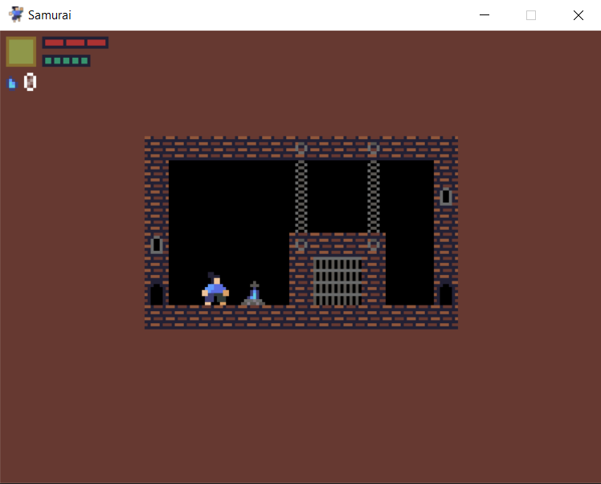
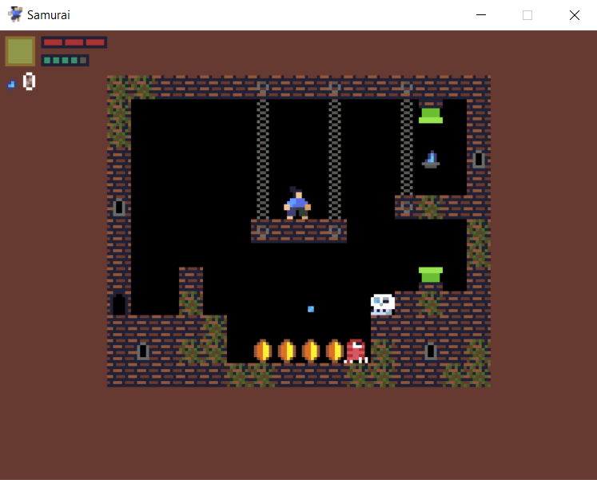
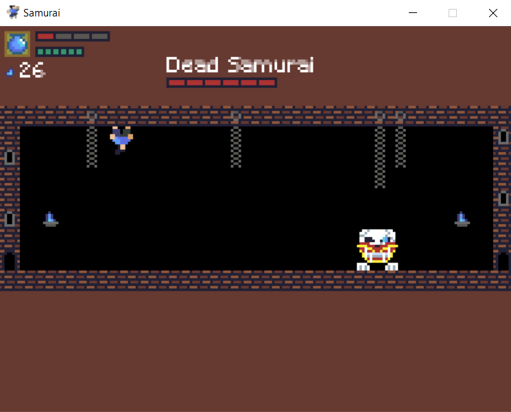

# Samurai Game
## Description
A simple and short platformer game developed with pygame library. Game combines features of metroidvania, soulsborne and mario games. All sprites for the game were drawn with aseprite. Youtube video [link](https://www.youtube.com/watch?v=X7mwhu6LrvE) with a game demonstration.
## Features
* Level system like in metroidvania games;
* Simple saving system based on bonfires like in soulsborne games. The saving system was developed with sqlite;
* Simple character leveling system like in soulsborne games;
* Gravity potion, which changes gameplay;
* Different enemies and a final boss fight.
## Screenshots

